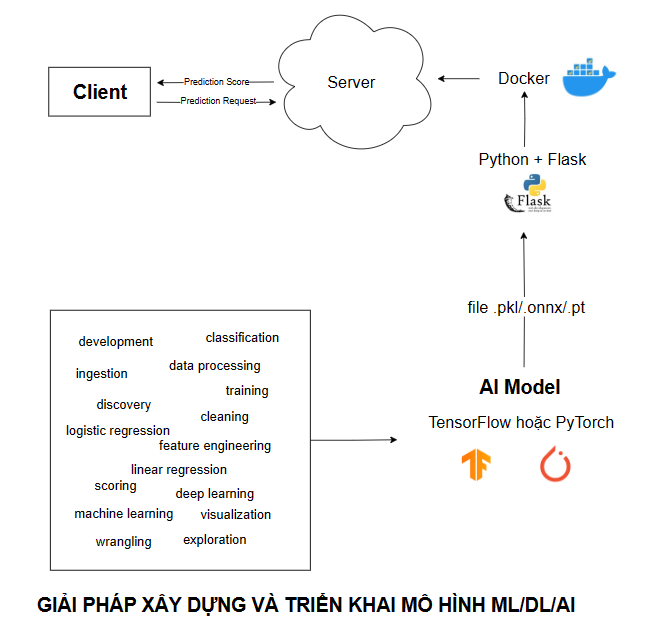

# CV TrainingTool

## 1. Sơ đồ



- **Giao diện trên eSales sẽ tích hợp nút training để người dùng tự huấn luyện, có các tham số mặc định kèm với tùy chỉnh cơ bản.**
- **Việc huấn luyện được thực hiện trên cloud VMs, thời gian vài tiếng, có in ra các log để kiểm tra quá trình huấn luyện.**
- **Người dùng sẽ tự kiểm thử và đánh giá.**

## 2. Cấu hình tham khảo cho dịch vụ **Cloud GPU**

- **NVIDIA T4 Tensor Core GPU for AI Inference**
    
    [NVIDIA T4 Tensor Core GPUs for Accelerating AI Inference](https://www.nvidia.com/en-us/data-center/tesla-t4/)
    
- **NVIDIA V100 Tensor Core**
    
    [NVIDIA V100 | NVIDIA](https://www.nvidia.com/en-us/data-center/v100/)
    
- **NVIDIA A100 Tensor Core GPU**
    
    [A100 GPU's Offer Power, Performance, & Efficient Scalability](https://www.nvidia.com/en-us/data-center/a100/)
    
- **Cấu hình tối thiểu: NVIDIA T4 Tensor Core GPU for AI Inference**
    - **GPU Memory: 16 GB GDDR6**
- **Cấu hình trung bình: NVIDIA V100 Tensor Core**
    - **GPU Memory: 32GB CoWoS HBM2**
- **Cấu hình trung bình: NVIDIA A100 Tensor Core GPU**
    - **GPU Memory: 40GB CoWoS HBM2**
- Nên sử dụng từ NVIDIA V100 Tensor Core hoặc tương đương để xử lý tốt chức năng huấn luyện

## **3 Hướng dẫn chi tiết sử dụng ứng dụng Streamlit cho việc huấn luyện và phát hiện đối tượng**

- Ứng dụng này được thiết kế để hỗ trợ nhập dữ liệu, huấn luyện mô hình và phát hiện đối tượng.
- Có 3 bước:
    - Nhập dữ liệu
    - Huấn luyện
    - Phát hiện đối tượng

### Bước 1: Nhập Dữ liệu

1. **Chọn phương thức nhập**
- Mở ứng dụng và chọn "Import Database" từ thanh điều hướng bên trái.
- Chọn phương thức nhập dữ liệu: "Import from Custom Vision" hoặc "Import from a ZIP file".
1. **Nhập từ Custom Vision**
- Chọn CustomVisionResource [S0]
- Chọn dự án cần huấn luyện > Nhấn nút **Project Settings** bên góc phải trên cùng của màn hình
- Lưu project ID và training key của dự án:
- Demo:
    - Project Name: JJVN_TBAI
    - project ID: 58af6408-2737-4027-8e1a-fde72efd9ebf
    - Key: 14f8cc99ea3648a6a2ccc49c5946e419
        
        
        
    
    
    
- Tại ứng dụng TrainingTool, nhập project ID và training key.
- Đặt tỷ lệ chia tập huấn luyện và kiểm thử trong trường "Enter validation split ratio".
- Nhấn "Download" để tải dữ liệu. Hệ thống sẽ xóa dữ liệu cũ, tạo thư mục mới và tải dữ liệu về.
- Dữ liệu được chia thành tập huấn luyện và kiểm thử theo tỷ lệ đã nhập.


- Đặt tỷ lệ chia tập huấn luyện và kiểm thử trong trường "Enter validation split ratio".
- Nhấn "Download" để tải dữ liệu. Hệ thống sẽ xóa dữ liệu cũ, tạo thư mục mới và tải dữ liệu về.
- Dữ liệu được chia thành tập huấn luyện và kiểm thử theo tỷ lệ đã nhập.


1. **Nhập từ tệp ZIP**
- Tải lên tệp ZIP chứa hình ảnh và nhãn.
- Tệp ZIP sẽ được giải nén tự động vào thư mục "data".
- Hệ thống sẽ tạo bản đồ lớp từ "data/data.yaml" sang "data/mapping.txt".
- Thông báo thành công sẽ hiển thị sau khi tải và giải nén thành công.


### Bước 2: Huấn luyện

1. **Cài đặt tham số huấn luyện**
- Chọn "Training" từ thanh điều hướng.
- Điền các thông số như số epoch, kích thước batch, tỷ lệ học, v.v.
- Các thông số này bao gồm:
- Epochs: Số lần lặp qua toàn bộ dữ liệu.
- Patience: Số epoch chờ đợi không cải thiện trước khi dừng sớm.
- Batch Size: Kích thước lô dữ liệu trong một lần cập nhật tham số.
- Image Size: Kích thước hình ảnh đầu vào.
- Optimizer: Phương pháp tối ưu hóa.
- Initial Learning Rate: Tốc độ học ban đầu.
- Final Learning rate: Tốc độ học cuối cùng.
1. **Bắt đầu huấn luyện**
- Nhấn "Start Training" để bắt đầu quá trình huấn luyện.


- Mô hình tốt nhất sẽ được lưu lại sau khi huấn luyện.


### Bước 3: Phát hiện Đối tượng

1. **Cấu hình và tải mô hình**
- Chọn "Object Detection" từ thanh điều hướng.
- Tải lên hình ảnh và chọn mô hình đã huấn luyện (.pt file).
- Điều chỉnh ngưỡng tin cậy của mô hình.
1. **Phát hiện đối tượng**
- Nhấn "Detect Objects" để bắt đầu phát hiện.
- Hình ảnh sẽ được hiển thị với các đối tượng được đánh dấu.
- Thông tin chi tiết về các đối tượng được phát hiện sẽ được hiển thị, bao gồm tên lớp và số lượng.
    
    
    


**Lưu ý khi sử dụng:**

- Đảm bảo rằng các thư mục dữ liệu cần thiết đã được tạo và cấu hình đúng trước khi bắt đầu các bước nhập dữ liệu hoặc huấn luyện.
- Kiểm tra và xử lý các lỗi có thể xảy ra trong quá trình nhập dữ liệu và huấn luyện để đảm bảo quá trình diễn ra suôn sẻ.
- Các thông số như tỷ lệ học, số epoch, và kích thước batch có thể cần được điều chỉnh tùy theo đặc thù của dữ liệu và yêu cầu của mô hình.

Ứng dụng này hỗ trợ người dùng từ bước nhập dữ liệu ban đầu cho đến huấn luyện và phát hiện đối tượng, qua đó giúp đơn giản hóa quá trình làm việc cho các nhiệm vụ phát hiện đối tượng.

---

## Hướng dẫn chạy chương trình trên local

**Cài Virtualenv**

```
pip install virtualenv

```

**Tạo môi trường ảo**

- Mở terminal và di chuyển đến thư mục dự án. Sau đó, sử dụng lệnh sau để tạo một môi trường ảo mới (thay `myenv` bằng tên muốn đặt cho môi trường ảo):

```
python -m venv myenv

```

**Kích hoạt môi trường ảo**

- Trên Linux/macOS:

```
source myenv/bin/activate

```

- Trên Windows (PowerShell)

```
.\\myenv\\Scripts\\Activate.ps1

```

- Trên Windows (Command Prompt):

```
.\\myenv\\Scripts\\activate

```

- **Cài các thư viện trong** requirements.txt

```
pip install -r requirements.txt

```

- Chạy chương trình:

```
streamlit run app.py
```

**Thoát khỏi môi trường ảo**

```
deactivate

```

---

## Giải thích thuật toán và công nghệ

### 1. **Streamlit Framework**

- **Streamlit** là công nghệ chính dùng để tạo giao diện người dùng của ứng dụng. Nó chịu trách nhiệm render các nút, thanh trượt, trình tải tệp và hiển thị hình ảnh và văn bản trên trang.
- Trang ứng dụng được cấu trúc thành ba bước chính:
    1. **Nhập dữ liệu**
    2. **Đào tạo**
    3. **Phát hiện đối tượng**
- Mỗi bước (hoặc "step") được điều khiển qua thanh điều hướng bên sidebar mà người dùng chọn.

### 2. **Mô Hình YOLO (You Only Look Once)**

- Đây là một **thuật toán phát hiện đối tượng thời gian thực** được sử dụng để phát hiện đối tượng trong hình ảnh. Ứng dụng sử dụng **YOLOv8** từ thư viện **Ultralytics**.
- **YOLOv8** là một mô hình học sâu có khả năng phát hiện đối tượng trong hình ảnh và video một cách hiệu quả. Nó hoạt động bằng cách chia hình ảnh thành lưới và dự đoán các hộp giới hạn và xác suất lớp cho mỗi ô lưới.
- Mô hình được đào tạo bằng cách sử dụng dữ liệu tùy chỉnh và sau đó được sử dụng để phát hiện đối tượng trong hình ảnh được tải lên.

### 3. **Xử Lý Tệp và Dữ Liệu**

- **Nhập dữ liệu**:
    - **Từ Custom Vision**: Người dùng nhập `project_id` và `training_key`, và các hình ảnh được tải xuống từ nền tảng Custom Vision. Những hình ảnh này được lưu trữ trong thư mục `data/train/images` và `data/train/labels`.
    - **Từ Tệp ZIP**: Người dùng có thể tải lên một tệp ZIP chứa hình ảnh và dữ liệu hộp giới hạn tương ứng. Ứng dụng giải nén tệp ZIP này vào thư mục `data` và xử lý nó để tạo một tệp ánh xạ lớp (`data/mapping.txt`).
    - Trong cả hai trường hợp, dữ liệu được chia thành các tập huấn luyện và tập xác thực dựa trên tỷ lệ mà người dùng cung cấp.
- **Đào tạo Mô Hình YOLO**:
    - Người dùng có thể điều chỉnh các tham số đào tạo như `epochs`, `batch size`, `image size`, `learning rate`, v.v.
    - Những tham số này được truyền vào hàm `run_yolo_training()`, bắt đầu quá trình đào tạo mô hình YOLO bằng dữ liệu đã được xử lý. Các trọng số (mô hình đã đào tạo) được lưu trữ trong thư mục `weights`.
    - Ứng dụng cũng hỗ trợ **dừng sớm** bằng cách sử dụng tham số `patience`, điều này giúp dừng quá trình đào tạo nếu hiệu suất của mô hình trên dữ liệu xác thực không cải thiện sau một số epoch nhất định.
- **Phát hiện Đối tượng**:
    - Người dùng chọn một mô hình đã đào tạo (`.pt` file) và tải lên một hình ảnh. Hình ảnh được xử lý bằng OpenCV để thay đổi kích thước và chuyển đổi màu, và YOLO được sử dụng để dự đoán các đối tượng trong hình ảnh.
    - **Hộp giới hạn**: Các đối tượng được phát hiện sẽ có các hộp giới hạn được vẽ bằng OpenCV, và các lớp sẽ được gán nhãn trên hình ảnh. Hình ảnh đã xử lý này sau đó được hiển thị trên giao diện người dùng.
    - Kết quả phát hiện, bao gồm tên lớp và thông tin hộp giới hạn, được lưu trữ trong `prediction_dict`.

### 4. **Lưu Trữ Tệp**

- **Tệp Dữ Liệu**:
    - Dữ liệu được lưu trữ trong thư mục `data` sau khi được tải xuống từ Custom Vision hoặc giải nén từ tệp ZIP tải lên.
- **Tệp Trọng Số và Mô Hình**:
    - Trọng số của mô hình YOLO đã đào tạo được lưu trong thư mục `weights` dưới dạng các tệp `.pt`. Những tệp này có sẵn để chọn trong bước phát hiện đối tượng.
- **Tệp Tạm Thời**:
    - Các tệp tạm thời như hộp giới hạn và hình ảnh được xử lý trong quá trình phát hiện đối tượng được xử lý trong bộ nhớ bằng OpenCV và NumPy, vì vậy không có tệp bổ sung nào được lưu trên đĩa trừ khi người dùng lưu chúng một cách rõ ràng.

### 5. **OpenCV để Xử Lý Hình Ảnh**

- **OpenCV** được sử dụng để đọc, thay đổi kích thước và xử lý các hình ảnh trước khi truyền cho mô hình YOLO. Nó thực hiện:
    - **Tải hình ảnh**: Đọc hình ảnh tải lên và chuyển đổi nó từ byte thành định dạng có thể đọc được bởi OpenCV.
    - **Thay đổi kích thước**: Ứng dụng thay đổi kích thước hình ảnh tải lên trong khi giữ nguyên tỷ lệ để vừa với chiều dài ngắn cố định (ví dụ: 1200 pixel).
    - **Vẽ Hộp Giới Hạn**: Khi các đối tượng được phát hiện, OpenCV được sử dụng để vẽ các hình chữ nhật quanh các đối tượng phát hiện, thêm nhãn lớp và hiển thị hình ảnh đã xử lý trên giao diện người dùng.

### 6. **Ánh Xạ Lớp**

- Ứng dụng duy trì một **ánh xạ lớp** từ ID đối tượng (số) đến tên lớp (dễ đọc). Ánh xạ này được tạo ra từ metadata của dữ liệu và rất quan trọng để hiểu rõ từng đối tượng được phát hiện.
- Nó được sử dụng trong bước phát hiện đối tượng để gán nhãn chính xác các đối tượng phát hiện.

### 7. **Công Nghệ Khác**

- **Numpy**: Được sử dụng để xử lý dữ liệu số và chuyển đổi dữ liệu hình ảnh thành các mảng có thể được OpenCV và YOLO xử lý.
- **Shutil**: Được sử dụng để quản lý tệp và thư mục, chẳng hạn như xóa các thư mục cũ hoặc làm sạch thư mục `data` trước khi bắt đầu một quy trình đào tạo mới.

### Tóm Tắt Quy Trình Dữ Liệu

1. **Bước Nhập Dữ Liệu**:
    - Dữ liệu được tải xuống từ Custom Vision hoặc tải lên dưới dạng tệp ZIP, sau đó lưu trữ trong thư mục `data/train`.
    - Dữ liệu được chia thành các tập huấn luyện và xác thực.
2. **Bước Đào Tạo**:
    - Mô hình YOLO được đào tạo trên dữ liệu với các tham số đào tạo do người dùng thiết lập. Trọng số được lưu trong thư mục `weights`.
3. **Bước Phát Hiện Đối Tượng**:
    - Người dùng chọn một mô hình và tải lên một hình ảnh.
    - Mô hình YOLO phát hiện đối tượng trong hình ảnh, và ứng dụng hiển thị kết quả với các hộp giới hạn và nhãn lớp.

Ứng dụng này cung cấp một quy trình toàn diện từ việc nhập dữ liệu, đào tạo mô hình, đến việc phát hiện đối tượng trong hình ảnh.